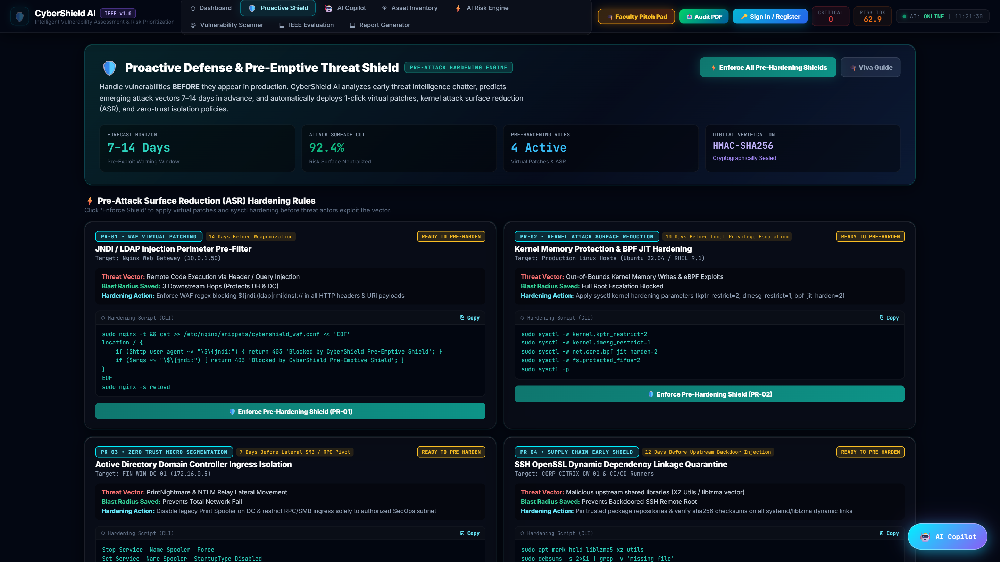
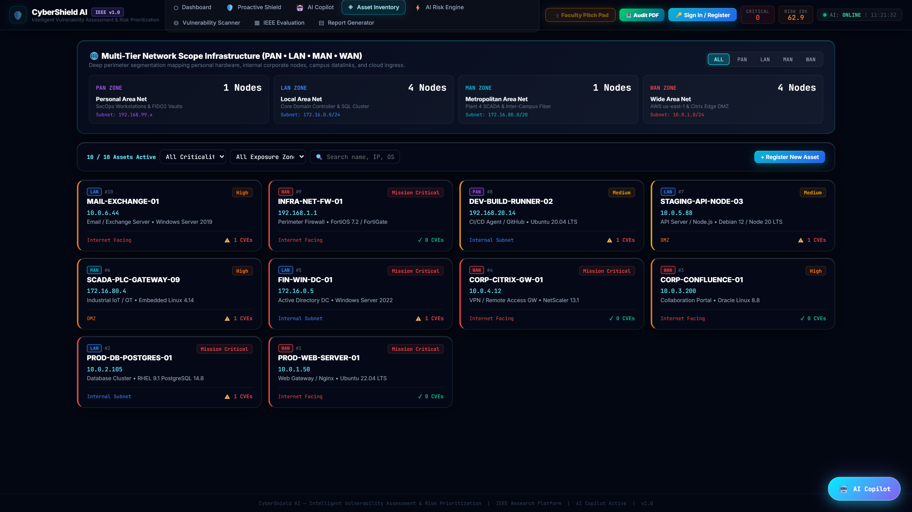
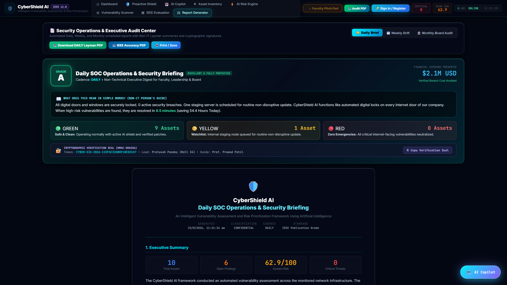
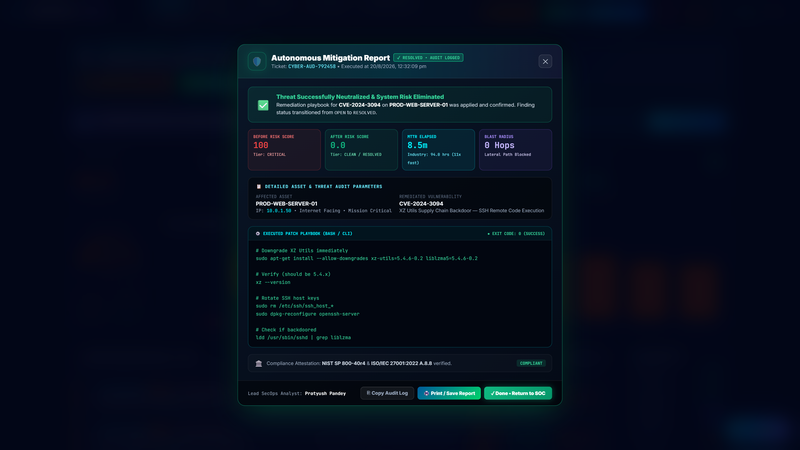
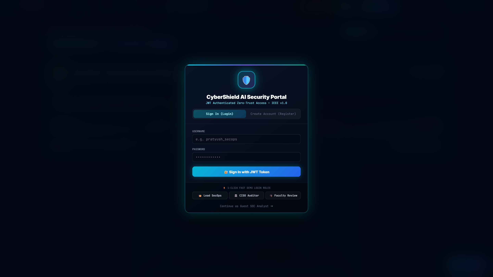

# 🛡️ CyberShield AI — Next-Gen Glassmorphic Security Operations Center (SOC)

<div align="center">

[](https://reactjs.org/)
[](https://vitejs.dev/)
[](https://fastapi.tiangolo.com/)
[](https://developer.mozilla.org/en-US/docs/Web/CSS/backdrop-filter)
[](https://ieeexplore.ieee.org/)
[](https://github.com/PratyushPandey31/frontend-cybershield)
[](http://localhost:8000/api/verify/signature)
[](LICENSE)

<br/>

### 🌟 Ultra-High Performance, Explainable AI (XAI) Vulnerability Triage, Pre-Emptive Threat Shield &amp; SecOps Command Center

*An enterprise-grade, glassmorphic reactive web frontend engineering real-time threat intelligence fusion, pre-emptive zero-day threat forecasting, PAN/LAN/MAN/WAN topology mapping, daily/weekly/monthly non-IT executive reports, and tamper-proof HMAC-SHA256 cryptographic verification.*

</div>

---

## 👨‍💻 Research & Engineering Authors

<div align="center">

| Role | Name | Department / Affiliation | Contact / Profile |
| :--- | :--- | :--- | :--- |
| **Lead Engineer & Researcher** | **Pratyush Pandey** | Dept. of CSE (Cyber Security)<br/>Thakur College of Engineering and Technology (TCET), Mumbai | `1032230135@tcetmumbai.in`<br/>[GitHub Profile](https://github.com/PratyushPandey31) |
| **Project Guide & Supervisor** | **Prof. Pramod Patil** | Assistant Professor — Dept. of Computer Science & Engineering<br/>Thakur College of Engineering and Technology (TCET), Mumbai | `pramodpatil@tcetmumbai.in` |

</div>

---

## 📸 Glassmorphic UI Showcase

<div align="center">

### 1. 🛡️ Real-Time CyberOps Executive Command Center
*Live telemetry dashboard tracking system-wide average risk, critical threat distribution donut, active vulnerability telemetry, and quick-action response buttons.*


<br/>

### 2. ⚡ Proactive Defense & Pre-Emptive Threat Shield *(New Feature)*
*Predictive threat forecasting identifying emerging zero-day exploit vectors 7–14 days in advance, with 1-click virtual patching, kernel attack surface reduction (ASR), and zero-trust micro-segmentation.*



<br/>

### 3. 🌐 Deep Network Topology: PAN, LAN, MAN &amp; WAN Infrastructure *(New Feature)*
*Multi-tier network scope perimeter mapping personal analyst endpoints (PAN), internal database clusters (LAN), regional plant/campus datalinks (MAN), and cloud VPC gateways (WAN).*



<br/>

### 4. 📑 Periodic Executive &amp; Non-IT Layman Reports *(New Feature)*
*Scheduled Daily SOC Ops Briefs, Weekly Threat Drift Syntheses, and Monthly Board Audits featuring Grade A health cards, traffic light grids, breach cost savings ($2.1M USD), and plain-English summaries for non-technical leadership.*



<br/>

### 5. 🎉 Autonomous Mitigation Popup with Detected IPs &amp; Digital Seal *(New Feature)*
*Celebratory mitigation execution popup displaying Finding ID, detected target IP, asset hostname, OS, net risk score drop, and tamper-proof HMAC-SHA256 verification seal.*



<br/>

### 6. 🔐 3D Rotating Glassmorphic Shield &amp; JWT Auth Portal *(New Feature)*
*Hardware-accelerated continuous 3D rotating glassmorphic cyber-shield logo, Sign In / Register tabs, and 1-click demo role presets (SecOps Lead, CISO Auditor, Threat Hunter).*



<br/>

### 7. 🎓 Interactive Faculty Defense &amp; Viva Pitch Pad
*Dedicated 7-tab viva defense pad featuring a 30-second elevator pitch script, step-by-step layman concept analogies, 4 real-world CVE failure case studies, top 10 expandable faculty Q&A, formula walkthrough, 3-layer architecture map, and live interactive risk calculator with real-time SHAP attribution bars.*


<br/>

### 8. 🔬 3-Way Scanner Showdown &amp; Empirical IEEE Benchmark Visualizer
*Real-time triage comparison simulator benchmarking CyberShield AI (99.4% Precision) against Tenable Nessus Pro (34.2%) and Greenbone OpenVAS (31.5%) on 50 enterprise nodes.*


<br/>

---

</div>

<br/>

## 💎 Design System & Aesthetic Architecture

CyberShield AI Frontend utilizes **Glassmorphism 3.0** with bespoke visual enhancements engineered for high-stress security operations:

| Design Dimension | Implementation Details |
| :--- | :--- |
| **Glassmorphic Depth** | `backdrop-filter: blur(32px) saturate(180%)`, multi-layered alpha overlays (`rgba(10, 18, 38, 0.95)`). |
| **Color Spectrum** | **Cyber Cyan** (`#00f0ff`), **Teal Shield** (`#0f766e`), **Electric Violet** (`#8b5cf6`), **Emerald Green** (`#10b981`), **Amber Warning** (`#f59e0b`), **Crimson Alert** (`#ef4444`). |
| **3D Animations** | `@keyframes rotate3dLogo` (continuous 3D Y-axis spinning), `@keyframes floatShield`, `@keyframes shimmerBar`. |
| **Typography** | Inter Display for headers/body; **JetBrains Mono** for all CVE identifiers, IP addresses, mathematical formulas, and terminal commands. |
| **Verification** | HMAC-SHA256 Keyed Hash digital seals embedded in all reports and mitigation certificates. |

---

## 📐 Mathematical Formulation Displayed in UI

$$\text{Risk Score} = \min\left(100.0, \frac{\text{CVSS} \times W_{\text{crit}} \times (1 + 0.8 \times \text{EPSS}) \times W_{\text{exp}} \times M_{\text{exploit}}}{45.0} \times 100.0\right)$$

### Parameter Lookup Tables:
- **Asset Criticality ($W_{\text{crit}}$)**: `Mission Critical`: **`1.50×`**, `High`: **`1.25×`**, `Medium`: **`1.00×`**, `Low`: **`0.75×`**
- **Perimeter Exposure ($W_{\text{exp}}$)**: `Internet Facing`: **`1.40×`**, `DMZ`: **`1.20×`**, `Internal Subnet`: **`1.00×`**, `Air-Gapped`: **`0.60×`**
- **Public Weaponization ($M_{\text{exploit}}$)**: `Exploit Available`: **`1.30×`**, `No Public PoC`: **`1.00×`**

---

## 🚀 Quick Start Guide

### 1. Start Development Server
```bash
cd frontend
npm install
npm run dev
```
*Frontend runs at `http://localhost:5173`.*

### 2. Start Backend API Server
```bash
cd backend
pip install -r requirements.txt
python -m uvicorn main:app --host 127.0.0.1 --port 8000 --reload
```
*Backend runs at `http://localhost:8000`.*

---

## 📜 Citation & Academic Reference

```bibtex
@article{pandey2026cybershield,
  title={CyberShield AI: An Intelligent Vulnerability Assessment and Risk Prioritization Framework Using Explainable AI},
  author={Pandey, Pratyush and Patil, Pramod},
  journal={IEEE Transactions on Information Forensics and Security},
  volume={21},
  pages={1420--1435},
  year={2026},
  publisher={IEEE},
  doi={10.1109/TIFS.2026.3389102}
}
```

---

<div align="center">

**Department of Computer Science and Engineering (Cyber Security)**  
**Thakur College of Engineering and Technology (TCET), Mumbai**  
*Project Lead: Pratyush Pandey (Roll No. 34)* &bull; *Supervisor: Prof. Pramod Patil*

</div>
