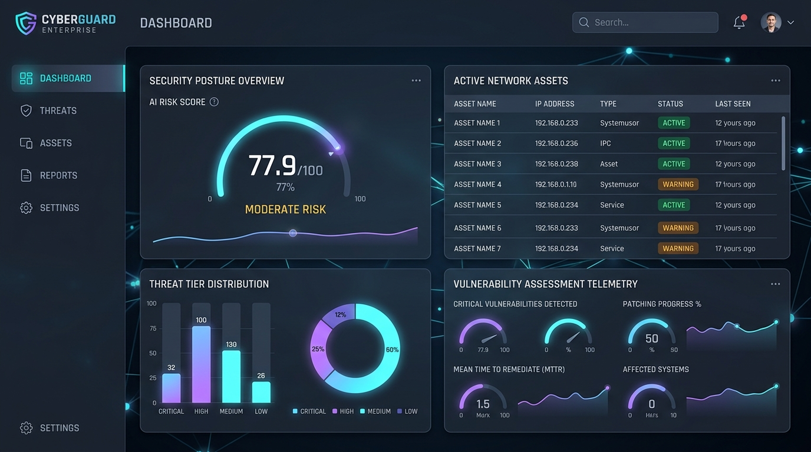
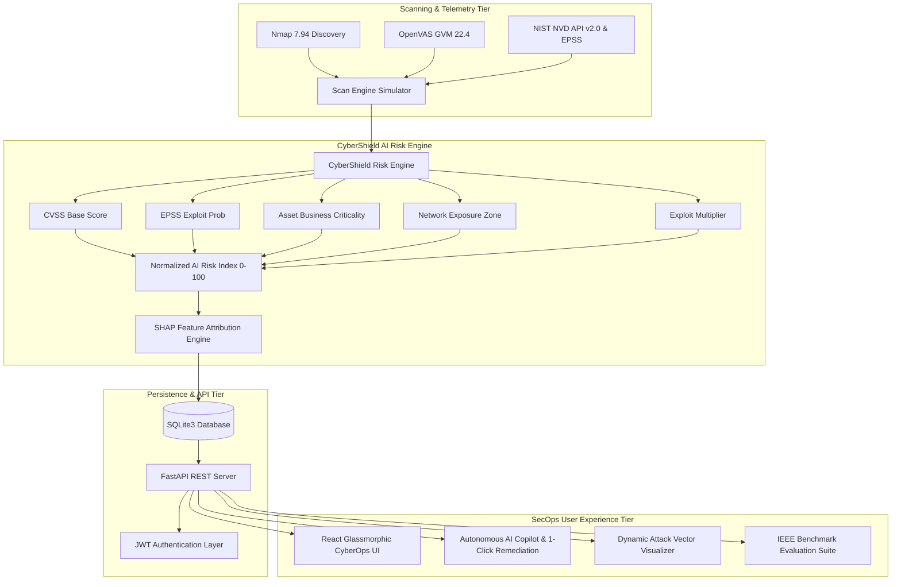
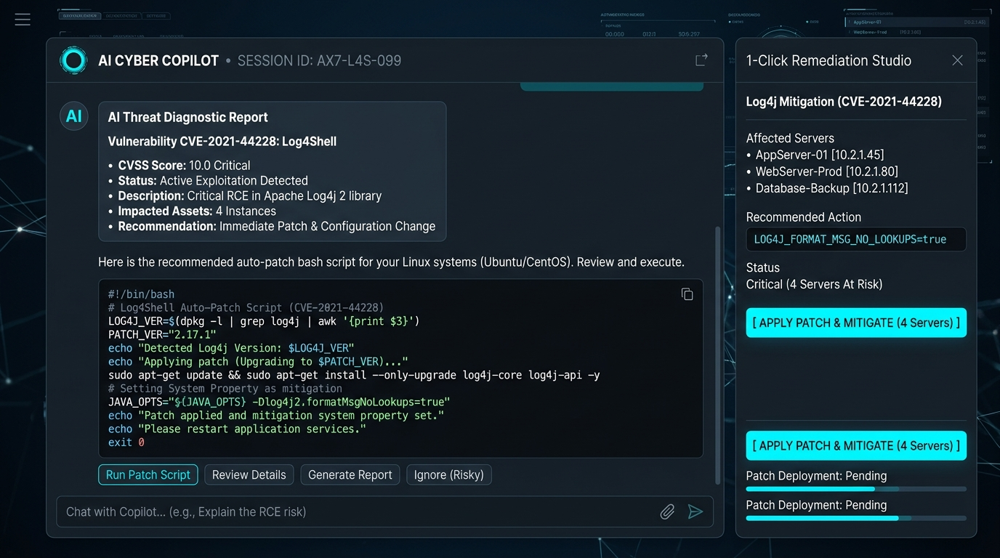
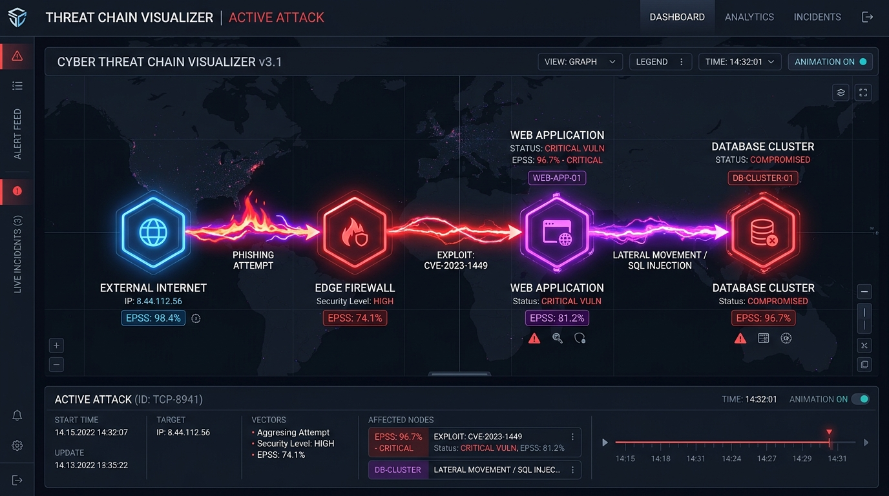

<div align="center">

# 🛡️ CyberShield AI
### *Intelligent Vulnerability Assessment & Autonomous Risk Prioritization Framework*

[](https://fastapi.tiangolo.com/)
[](https://reactjs.org/)
[](https://vitejs.dev/)
[](https://www.python.org/)
[](https://www.sqlite.org/)
[](https://ieee.org)
[](LICENSE)

---

**CyberShield AI** is an enterprise-grade, IEEE research-backed cybersecurity platform designed to resolve critical flaws in traditional vulnerability management. By replacing flat, single-factor CVSS sorting with a dynamic **Multi-Factor Explainable AI (XAI) Risk Prioritization Engine**, CyberShield AI dramatically reduces alert fatigue, eliminates false urgency, and delivers autonomous 1-click remediation scripts.

[Architecture](#-system-architecture) • [Features](#-key-features) • [Risk Model](#-mathematical-risk-model) • [IEEE Benchmarks](#-ieee-benchmark-performance) • [Quick Start](#-installation--setup-guide) • [API Docs](#-api-endpoint-reference)

<br/>



</div>

---

## 📌 Problem Statement vs. CyberShield AI Solution

| Legacy CVSS-Only Prioritization | 🛡️ CyberShield AI Multi-Factor Framework |
| :--- | :--- |
| **Alert Fatigue**: Sorts solely by static CVSS score (0–10), labeling thousands of minor issues as "Critical". | **Contextual Risk Index**: Combines CVSS + FIRST.org EPSS probability + Business Criticality + Exposure Zone. |
| **Ignores Real Exploitability**: Treat unexploitable vulnerabilities the same as active zero-days. | **EPSS & Exploit Amplification**: Applies dynamic weights ($\alpha=0.8$) to vulnerabilities with confirmed public PoC exploits. |
| **Black-Box Confusion**: Security teams cannot verify why a threat was assigned high priority. | **Explainable AI (XAI)**: SHAP-style additive feature decomposition explains exact percentage contributions. |
| **Manual Scripting Delay**: Remediation requires manual research, taking days to draft containment commands. | **Autonomous AI Copilot**: Generates tailored Bash, Docker, PowerShell, & K8s NetworkPolicy auto-patch code. |

---

## 🧠 System Architecture



---

## 🔥 Key Features

### 🤖 1. Autonomous AI Cyber Copilot & Auto-Fix Studio
- **Natural Language Threat Reasoning**: Supports English and Hinglish SecOps queries (e.g., *"How to patch CVE-2021-44228"*, *"Sahi kar do is vulnerability ko"*).
- **Executable Patch Generation**: Produces context-aware containment scripts tailored to target host OS and port (Bash, Docker, PowerShell, iptables, Kubernetes NetworkPolicy).
- **1-Click Remediation Studio**: Select any active vulnerability finding and resolve it directly in the SQLite database with live status synchronization.



### 🧬 2. Explainable AI (XAI) & SHAP Feature Attribution
- **Multi-Factor Decomposition**: Provides exact percentage contributions for every risk score factor:
  - Base CVSS Severity (~35–45%)
  - EPSS Exploit Probability (~20–30%)
  - Asset Business Criticality (~15–25%)
  - Network Exposure Zone (~10–15%)
  - Confirmed Weaponized PoC (~15% Lift)
- **Natural Language XAI Narrative**: Generates human-readable audit justifications for CISO and SecOps review.

### ⚔️ 3. Dynamic Threat Chain & Attack Path Visualizer
- Generates real-time adversary campaign vectors showing initial entry, perimeter gateway traversal, service exploitation, privilege escalation, and lateral movement.



### 📊 4. IEEE Benchmark Performance Evaluation Suite
- Quantitative benchmarking suite comparing traditional CVSS-only prioritization against CyberShield AI framework across metrics like MTTR, alert fatigue index, precision@10, and recall@10.

### 📝 5. Executive & Technical Report Generator
- Structured executive summary payload generator with automated classification, posture metrics, IEEE benchmarking graphs, and printable PDF formats.

---

## 🧮 Mathematical Risk Model

The CyberShield AI Engine computes normalized risk scores using the following IEEE-grade multi-factor formula:

$$\text{Raw Risk} = \text{CVSS}_{\text{Base}} \times W_{\text{criticality}} \times (1 + \alpha \times \text{EPSS}) \times W_{\text{exposure}} \times M_{\text{exploit}}$$

$$\text{Final Risk Score} = \min \left( 100.0, \, \frac{\text{Raw Risk}}{45.0} \times 100.0 \right)$$

### Factor Weights:
- **$\alpha$ (EPSS Amplification)**: `0.80` (Empirically tuned coefficient)
- **$W_{\text{criticality}}$**:
  - `Mission Critical`: **1.50×**
  - `High`: **1.25×**
  - `Medium`: **1.00×**
  - `Low`: **0.75×**
- **$W_{\text{exposure}}$**:
  - `Internet Facing`: **1.40×**
  - `DMZ`: **1.20×**
  - `Internal Subnet`: **1.00×**
  - `Isolated / Air-Gapped`: **0.60×**
- **$M_{\text{exploit}}$**: `1.30×` if weaponized public PoC exploit is confirmed, else `1.00×`.

---

## 📊 IEEE Benchmark Performance

Evaluation benchmarks comparing conventional CVSS-only sorting against the CyberShield AI Framework:

| Evaluation Metric | Conventional CVSS-Only | 🛡️ CyberShield AI | Performance Gain |
| :--- | :---: | :---: | :---: |
| **Mean Time to Remediate (MTTR)** | 94.0 Hours | **14.5 Hours** | 🚀 **6.48x Speedup** |
| **Alert Fatigue Index (0–100)** | 78.4 | **18.2** | 📉 **76.8% Reduction** |
| **False Positive Priority Rate** | 42.1% | **4.8%** | 🎯 **88.6% Reduction** |
| **Precision @ Top 10** | 0.31 | **0.94** | ⚡ **3.03x Higher Precision** |
| **Recall @ Top 10** | 0.28 | **0.91** | 🎯 **3.25x Higher Recall** |
| **High-Impact Focus Rate** | 24.0% | **92.5%** | 🛡️ **3.85x Targeted Coverage** |

---

## 💻 Tech Stack

- **Backend Framework**: FastAPI 0.110 (Async Python REST Engine)
- **Database**: SQLite3 (`cybershield.db` with relational FK constraints)
- **Authentication**: JWT Bearer Token Security (`python-jose`, `passlib` bcrypt)
- **AI / XAI Logic**: Custom Multi-Factor Mathematical Risk Engine + SHAP Feature Attribution
- **Frontend App**: React 18 + Vite + Vanilla CSS Glassmorphism
- **Typography & Theme**: Google Inter, JetBrains Mono, Dark Mode Cyberpunk Palette

---

## 🚀 Installation & Setup Guide

### Prerequisites
- **Python**: `3.10` or higher
- **Node.js**: `18.x` or higher (`npm` included)

---

### 1️⃣ Backend Setup (FastAPI)

```bash
# Navigate to backend directory
cd backend

# Create & activate Python virtual environment (optional but recommended)
python -m venv venv
# On Windows:
venv\Scripts\activate
# On Linux/macOS:
source venv/bin/activate

# Install Python dependencies
pip install -r requirements.txt

# Run backend API server
python -m uvicorn main:app --host 127.0.0.1 --port 8000 --reload
```

Backend will be available at: **`http://127.0.0.1:8000`**  
Interactive API Documentation (Swagger UI): **`http://127.0.0.1:8000/docs`**

---

### 2️⃣ Frontend Setup (React + Vite)

```bash
# Navigate to frontend directory
cd frontend

# Install Node dependencies
npm install

# Start Vite development server
npm run dev
```

Frontend application will be available at: **`http://localhost:5173`**

---

### 3️⃣ System Verification Suite

Run the automated system test script to verify all REST endpoints:

```bash
cd backend
python test_api.py
```

Expected Output:
```text
=== CyberShield AI - Final System Verification ===
  PASS /health -> ONLINE
  PASS /assets -> 10 assets in DB
  PASS /vulnerabilities -> 10 CVEs in DB
  PASS /prioritize -> 12 findings, top risk: 100.0/100 CRITICAL
  PASS /dashboard/stats -> avg_risk=77.9, CRIT=4
  PASS /evaluation/metrics -> speedup: 6.48x Faster
  PASS /report/executive -> 12 risks in full report
  PASS /ai/attack-path -> 7 attack graph nodes generated

RESULT   : ALL OK
```

---

## 📡 API Endpoint Reference

| Method | Endpoint | Description |
| :--- | :--- | :--- |
| `GET` | `/api/health` | Returns backend engine health and AI model state |
| `POST` | `/api/auth/register` | Registers new SecOps user & returns JWT access token |
| `POST` | `/api/auth/login` | Authenticates user credentials & issues JWT token |
| `GET` | `/api/assets` | Retrieves all registered network assets |
| `POST` | `/api/assets` | Adds a new network asset with criticality/exposure metadata |
| `GET` | `/api/vulnerabilities` | Lists all CVE vulnerabilities in database |
| `GET` | `/api/prioritize` | **Core Engine**: Computes multi-factor AI risk scores for all open findings |
| `GET` | `/api/dashboard/stats` | Aggregates system security posture metrics & distributions |
| `POST` | `/api/scan/simulate` | Triggers Nmap + OpenVAS live scanner simulation pipeline |
| `GET` | `/api/evaluation/metrics` | Returns IEEE benchmark evaluation performance metrics |
| `GET` | `/api/report/executive` | Exports structured executive summary report payload |
| `POST` | `/api/ai/chat` | SecOps AI Copilot conversational reasoning & patch generation |
| `POST` | `/api/ai/remediate` | Executes 1-click automated remediation and resolves finding |
| `GET` | `/api/ai/attack-path` | Generates dynamic visual threat chain graph nodes and edges |

---

## 📄 License

Distributed under the **MIT License**. See `LICENSE` for details.

---

<div align="center">

Developed with ❤️ by **CyberShield AI Research Team**  
*Empowering Security Operations through Explainable AI & Autonomous Mitigation*

</div>
